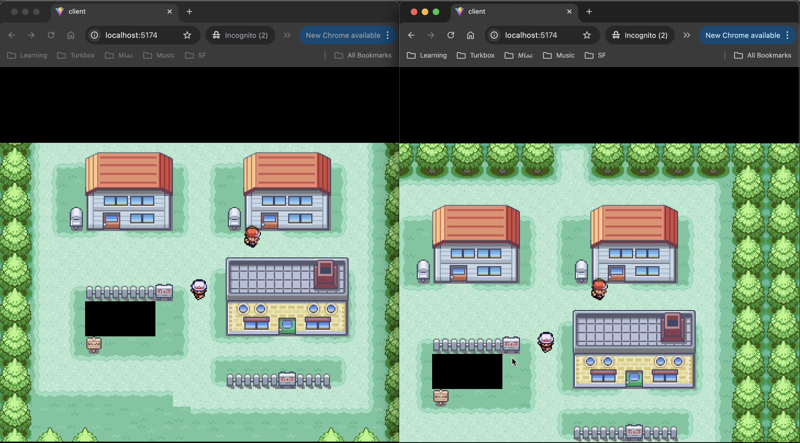

# Pokemon Clubhouse

A multiplayer social game inspired by Club Penguin, set in the Pokemon FireRed/LeafGreen world. Explore Pallet Town with friends, chat, and hang out in a nostalgic Pokemon environment.

 

## 🎮 About

Pokemon Clubhouse is a real-time multiplayer game that brings the social experience of Club Penguin to the beloved Pokemon FireRed/LeafGreen maps. Walk around Pallet Town, meet other players, and enjoy the nostalgia of classic Pokemon games in a multiplayer setting.


*Multiple players exploring Pallet Town together in real-time*

### Features

- **Real-time Multiplayer**: See other players moving around the map in real-time
- **Unique Sprites**: Each player gets a randomly assigned character sprite (trainers, NPCs)
- **Authentic Maps**: Using the original Pokemon FireRed/LeafGreen map data
- **Smooth Movement**: Pixel-perfect rendering with smooth character animations
- **Collision Detection**: Can't walk through trees, buildings, or other obstacles
- **Full-Screen Experience**: Responsive canvas that adapts to your screen size

## 🎨 Attribution

This project uses map data and sprites from:

**[JohtoBlaziken's Bootleg Pokémon FireRed: A ROM base without the ROM](https://www.pokecommunity.com/threads/johtoblazikens-bootleg-pok%C3%A9mon-firered-a-rom-base-without-the-rom-demo-v0-6.407866/)**

- Demo Version: v0.6
- Author: JohtoBlaziken
- Source: PokéCommunity Forums
- License: As per the original project's terms

All Pokemon-related trademarks and copyrights are property of Nintendo, Game Freak, and The Pokemon Company.

## 🚀 Getting Started

### Prerequisites

- Node.js (v18 or higher)
- npm or yarn

### Installation

1. **Clone the repository**
   ```bash
   git clone https://github.com/yourusername/pokemon-clubhouse.git
   cd pokemon-clubhouse
   ```

2. **Install client dependencies**
   ```bash
   cd client
   npm install
   ```

3. **Install server dependencies**
   ```bash
   cd ../server
   npm install
   ```

### Running the Application

You'll need to run both the server and client in separate terminals.

**Terminal 1 - Start the Server:**
```bash
cd server
node index.js
```
The server will start on `ws://localhost:8080`

**Terminal 2 - Start the Client:**
```bash
cd client
npm run dev
```
The client will start on `http://localhost:5173` (or another port if 5173 is in use)

### Opening Multiple Players

To test multiplayer functionality:
1. Open `http://localhost:5173` in multiple browser tabs or windows
2. Each tab will spawn as a different player with a unique sprite
3. Move around with arrow keys or WASD

## 🎯 Controls

- **Arrow Keys** or **WASD** - Move your character
- Characters move one tile at a time with smooth animation
- You cannot walk through obstacles (trees, buildings, water, etc.)

## 🏗️ Project Structure

```
pokemon-clubhouse/
├── client/                 # React + Vite frontend
│   ├── public/
│   │   ├── characters/    # Player sprites
│   │   ├── maps/          # Map JSON data
│   │   └── tilesets/      # Tileset images
│   ├── src/
│   │   ├── components/    # React components
│   │   ├── engine/        # Game engine (rendering, network, input)
│   │   └── App.jsx
│   ├── Dockerfile
│   └── package.json
├── server/                # Node.js WebSocket server
│   ├── index.js          # Server entry point
│   ├── Dockerfile
│   └── package.json
├── tools/                 # Map parsing and conversion tools
├── docker-compose.yml    # Docker orchestration
├── DEPLOYMENT.md         # Deployment guide
└── README.md
```

## 🐳 Docker Deployment

### Quick Start with Docker Compose

```bash
# Build and start all services
docker-compose up -d --build

# View logs
docker-compose logs -f

# Stop services
docker-compose down
```

Access the game at `http://localhost`

### Manual Docker Build

**Build Client:**
```bash
cd client
docker build -t pokemon-clubhouse-client .
docker run -p 80:80 pokemon-clubhouse-client
```

**Build Server:**
```bash
cd server
docker build -t pokemon-clubhouse-server .
docker run -p 8080:8080 pokemon-clubhouse-server
```

See [DEPLOYMENT.md](./DEPLOYMENT.md) for detailed deployment instructions.

## 🛠️ Technology Stack

### Client
- **React 19** - UI framework
- **Vite** - Build tool and dev server
- **Canvas API** - 2D rendering
- **WebSocket** - Real-time communication

### Server
- **Node.js** - Runtime
- **ws** - WebSocket library
- **uuid** - Player ID generation

### Tools
- Ruby scripts for map data extraction
- Node.js for map parsing

## 🗺️ Maps

Currently featuring:
- **Map 079**: Pallet Town

The map data is extracted from Pokemon FireRed and converted to JSON format for rendering.

## 🔧 Development

### Adding New Maps

1. Place map data in `client/public/maps/map-XXX.json`
2. Place tileset in `client/public/tilesets/`
3. Update `Game.jsx` to load the new map

### Adding New Character Sprites

1. Add sprite sheets (128x192 PNG, 4x4 grid) to `client/public/characters/`
2. Update `Game.jsx` sprite loading array
3. Update server sprite ID range

### Tools

The `tools/` directory contains Ruby scripts for:
- Extracting map data from RPG Maker format
- Converting map tiles to JSON
- Processing sprite sheets

## 🐛 Known Issues

- Autotiles (flowers, animated grass) render as base grass tiles
- No chat functionality yet
- No player names/labels
- Limited to one map (Pallet Town)

## 🎯 Roadmap

- [ ] Chat system
- [ ] Player names above characters
- [ ] Multiple maps with transitions
- [ ] Player emotes
- [ ] Avatar customization
- [ ] Proper autotile rendering
- [ ] Music and sound effects
- [ ] Private rooms/instances

## 🤝 Contributing

Contributions are welcome! Please feel free to submit a Pull Request.

1. Fork the repository
2. Create your feature branch (`git checkout -b feature/AmazingFeature`)
3. Commit your changes (`git commit -m 'Add some AmazingFeature'`)
4. Push to the branch (`git push origin feature/AmazingFeature`)
5. Open a Pull Request

## 📝 License

This project is licensed under the MIT License - see the LICENSE file for details.

## ⚠️ Disclaimer

This is a fan project and is not affiliated with, endorsed by, or connected to Nintendo, Game Freak, or The Pokemon Company. Pokemon and all related properties are trademarks of their respective owners.

This project is for educational and entertainment purposes only and is not intended for commercial use.

## 🙏 Acknowledgments

- **JohtoBlaziken** - For the Bootleg Pokemon FireRed ROM base assets
- **PokéCommunity** - For hosting and supporting ROM hacking community
- **Nintendo/Game Freak** - For creating the original Pokemon games
- **Club Penguin** - For the social multiplayer inspiration

## 📧 Contact

For questions or feedback, please open an issue on GitHub.

---